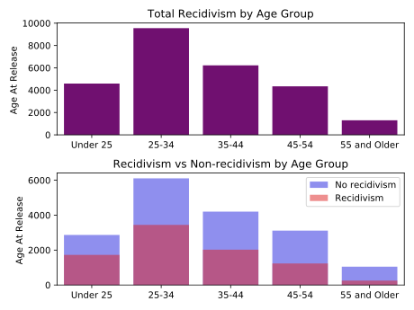
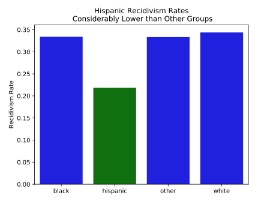
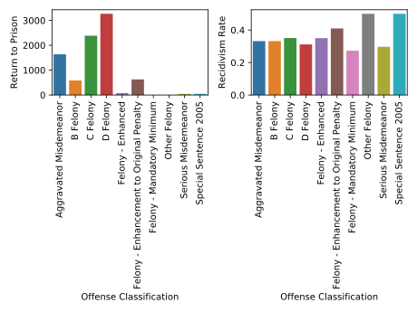

# prison_recidivism

# Guiding questions
1. What are the main factors which drive recidivism in the sample population?
2. Does recidivism rate mostly depend on individual characteristics or circumstance?
3. How could fiscal resources be redirected in order to improve recidivism rates?


## Data Source
The data for this project can be found at https://data.iowa.gov/Correctional-System/3-Year-Recidivism-for-Offenders-Released-from-Pris/mw8r-vqy4

## Data Prep
The raw data for this project is exclusively categorical.  Look in [encoding_funcs.py](./data/encoding_funcs.py) for the functions that make prelimianry transformations into one_hot_encoding/binaries/

## EDA
### Age
> The largest group by age is the 25-34 year old group, but
> The largest proportion of recidivism is the group under 25 years old.


### Race 
> Below, you will find the racial breakdown of the dataset. 

- White - Non-Hispanic                               0.676568
- black - non-hispanic                               0.235052
- white - hispanic                                   0.058561
- american indian or alaska native - non-hispanic    0.019315
- asian or pacific islander - non-hispanic           0.007387
- black - hispanic                                   0.001424
- american indian or alaska native - hispanic        0.000770
- white -                                            0.000462
- asian or pacific islander - hispanic               0.000192
- n/a -                                              0.000192
- black -                                            0.000077

> After running [chi2 tests](eda/hypothesis_test.py) and fitting a vanilla [logit model](modeling/logistic_for_p.py),
> many of the ethnicity groups did not show high statistical significance 
> in relation to recidivism. 
> With that in mind, along with simplifying the model for interpretation, 
> I binned the racial groups into white, black, hispanic and other.
> After doing so, one can see that hispanic prisoners have significantly lower recidivism rates.

]

## Offense classification
> Offense classifications show large numbers of recidvism in C and D class felonies, which are less serious than B. However, looking at the percentages, the is not much difference in the rates across the groups with a significant number of records. 




## feature engineering
   after pulling the raw data from the database, the data is converted to binary features with the code found in the data/feature_end.py file. none of the iowa data is numeric, not even age, which is provided as a range. therefore, i created dummy variables out of all features.

   the final model features are: race, age at release, conviction class, conviction type, conviction subtype, release type, supervising district, target population, initial supervision status, recidivism supervision status.

### notes on target and  individual features
#### target
  * the dataset is imbalanced. of the 24,387 records left after reducing the dataset, 8,334 are marked as recidivist and 16,053 are not recidivist.  that is a ratio of 1.93 non-recidivists to each recidivist.  this imbalance will be addressed by random-oversampling in the training sets of the models (see modeling section).
	 ```
## modeling
  * logistic regression
