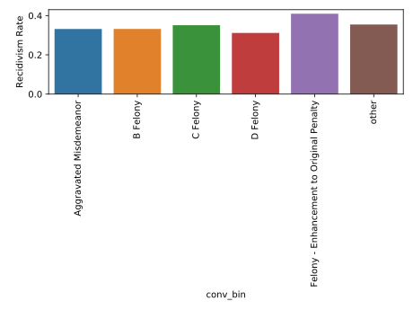

# prison_recidivism

# Guiding questions
1. What are the main factors which drive recidivism in the sample population?
2. Does recidivism rate mostly depend on individual characteristics or circumstance?
3. How could fiscal resources be redirected in order to improve recidivism rates?


## Data Source
The data for this project can be found at https://data.iowa.gov/Correctional-System/3-Year-Recidivism-for-Offenders-Released-from-Pris/mw8r-vqy4

## Data Prep
The raw data for this project is exclusively categorical.  Look in [encoding_funcs.py](./data/encoding_funcs.py) for the functions that make prelimianry transformations into one_hot_encoding/binaries/

## EDA
### Age
> The largest group by age is the 25-34 year old group, but
> The largest proportion of recidivism is the group under 25 years old.


### Race 
> Below, you will find the racial breakdown of the dataset. 

- White - Non-Hispanic                               0.676568
- black - non-hispanic                               0.235052
- white - hispanic                                   0.058561
- american indian or alaska native - non-hispanic    0.019315
- asian or pacific islander - non-hispanic           0.007387
- black - hispanic                                   0.001424
- american indian or alaska native - hispanic        0.000770
- white -                                            0.000462
- asian or pacific islander - hispanic               0.000192
- n/a -                                              0.000192
- black -                                            0.000077

> After running [chi2 tests](eda/hypothesis_test.py) and fitting a vanilla [logit model](modeling/logistic_for_p.py),
> many of the ethnicity groups did not show high statistical significance 
> in relation to recidivism. 
> With that in mind, along with simplifying the model for interpretation, 
> I binned the racial groups into white, black, hispanic and other.
> After doing so, one can see that hispanic prisoners have significantly lower recidivism rates.

]

## Offense classification
> Offense classifications show large numbers of recidvism in C and D class felonies, which are less serious than B. However, looking at the percentages, there is not much difference in the rates across the groups with a significant number of records. 




## Offense type


## Offense subtype
There is a lot of variance across conviction subtypes. 


I binned conviction types under 1%, yielding the distribution below:


### notes on target and  individual features
#### target
  * the dataset is imbalanced. of the 24,387 records left after reducing the dataset, 8,334 are marked as recidivist and 16,053 are not recidivist.  that is a ratio of 1.93 non-recidivists to each recidivist.  This imbalance will be addressed by random-oversampling in the training sets of the models (see modeling section).
	 ```
## Modeling and Interpretation

> After fitting multiple models on multiple dataframes with varying features, a logistic model trained with SMOTE with the following parameters performed best:


LogisticRegression(C=0.001, class_weight=None, dual=False, fit_intercept=True,
                   intercept_scaling=1, l1_ratio=None, max_iter=100,
                   multi_class='warn', n_jobs=None, penalty='l2',
                   random_state=None, solver='warn', tol=0.0001, verbose=0,
                   warm_start=False)

>I used SMOTE to increase the recall score.  Optimizing for recall, in the present study, is important.  False negatives are released persons who go back to prison, but the model predicts will not.  Optimizing to maximize recall allows the model to predict more recidivists at the price of more false positives.  

> The final test recall score with the logistic models is .614


The final model is tested [here](modeling/smaller_model.py)
The final model is validated on the test set [here](modeling/best_model.py)
The final data frame is created at the bottom of the .py file found [here](encoding_funcs.py)

> The logistic coefficients provided interesting insight. The top 4 features which affected the odds of returning to prison were:
 (0.08457146166524078, 'white race_binned'),
 (0.08545200394168768, 'Male'),
 (0.10629229467964753, '25-34 Age At Release '),
 (0.10991550489541471, 'Under 25 Age At Release ')]
 
> The bottom four were:
(-0.18451047311957094, 'Violent Offense Type'),
 (-0.1641536600871613, 'hispanic race_binned'),
 (-0.1536984455163177, '55 and Older Age At Release '),
 (-0.13217072605206934, '45-54 Age At Release ')

> These paint a clear picture of which types of released persons are at risk for recidivism: Young, white males.
> Older, hispanic prisoners are at less risk.  

> Suprisingly, drunk driving, murder, and assault are all relatively low risk offenses with regard to recidivism.

 (-0.07286516544895118, 'OWI subtype_bin'),
 (-0.06079473187976615, 'Murder/Manslaughter subtype_bin'),
 (-0.05826636092262317, 'Assault subtype_bin'
 
 > Burglary and Drug Possession are relatively high risk offenses with regard to recidivism.)
 
  (0.06046614558100768, 'Burglary subtype_bin'),
  (0.039916315399109836, 'Drug Possession subtype_bin')
